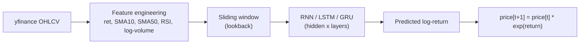
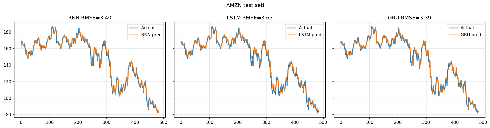
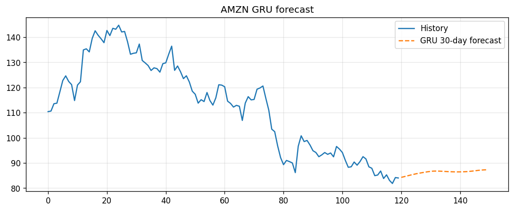

<p align="center">

# 📈 Stock Price Prediction with PyTorch


[](https://stock-price-prediction-pytorch.streamlit.app/)

</p>

Next-day stock price forecasting with **RNN, LSTM, and GRU** networks in PyTorch,
trained on real market data via `yfinance`. Comes with a training pipeline, an
exploratory notebook, a pytest suite, and an interactive **Streamlit app** where
you can train any ticker, tune the architecture, and see a multi-step forecast
with an uncertainty band.

**🔗 Try it live: [stock-price-prediction-pytorch.streamlit.app](https://stock-price-prediction-pytorch.streamlit.app/)**

## Contents
- [Why this isn't just "predict the closing price"](#why-this-isnt-just-predict-the-closing-price)
- [How it works](#how-it-works)
- [Streamlit app](#streamlit-app)
- [Project structure](#project-structure)
- [Setup](#setup)
- [Usage](#usage)
- [Testing](#testing)
- [Results](#results)
- [Deployment](#deployment)

## Why this isn't just "predict the closing price"

Most beginner tutorials feed raw closing prices into an RNN and predict the next
raw price. On a trending series that mostly teaches the model to copy yesterday's
value forward — it looks accurate on a chart but carries no real signal, and it
extrapolates badly the moment the trend breaks.

This project instead predicts the **next-day log-return** and reconstructs price as:

```
price[t+1] = price[t] * exp(predicted_return)
```

Log-returns are approximately stationary (mean/variance don't drift with the
trend the way raw prices do), which is what these models actually need to learn
something beyond "yesterday's price." The trade-off is honestly reported: the
[Results](#results) section below shows the models landing close to a naive
baseline, which is the expected, realistic outcome for daily price data — not a
result hidden because it isn't impressive.

## How it works



- **Features** (`src/data.py`): log-return, Close/SMA10, Close/SMA50, RSI, log-volume —
  all stationary or bounded, not raw price levels.
- **Split**: chronological 70/15/15 train/val/test (no shuffling — this is a time
  series, so future data never leaks into training).
- **Scaling**: `StandardScaler` fit on the training slice only, then applied to
  val/test — a common leakage point in tutorials, avoided here.
- **Training**: full-batch Adam, early stopping on validation loss, seeded for
  reproducible runs (`src/engine.py:set_seed`).
- **Forecasting**: multi-step recursive forecast — each predicted price feeds back
  in as the next step's input — with a residual-based 95% uncertainty band that
  widens with `sqrt(horizon)` to reflect compounding error.

## Streamlit app

[**Live demo →**](https://stock-price-prediction-pytorch.streamlit.app/) or run locally:
```
streamlit run app/streamlit_app.py
```

- Train any ticker/date range, or hit defaults (AMZN, 2010–2023) to instantly load
  the **pretrained weights** from `outputs/models/` instead of retraining from scratch.
- Tune lookback, hidden size, layers, and learning rate live, with tooltips explaining
  each parameter.
- Interactive Plotly charts (hover for exact values, zoom/pan) across three tabs:
  **Test Results** (RMSE/MAE/MAPE/directional accuracy + fit chart), **Forecast**
  (multi-step forecast with uncertainty band), and **About** (methodology).

## Project structure
```
src/        data.py (features/dataset), model.py (RNN/LSTM/GRU), engine.py (train/eval), forecast.py
scripts/    train.py — trains all three models, saves weights + metrics
app/        streamlit_app.py — interactive demo (Plotly, tabs)
.streamlit/ config.toml — app theme
notebooks/  stock_prediction_pytorch.ipynb — exploratory walkthrough with plots
tests/      pytest suite (synthetic data, no network calls)
outputs/    models/ (.pt + config.json), metrics/, figures/
```

## Setup
```
pip install -r requirements.txt
pip install jupyter          # only if you want to run the notebook
```

## Usage
```
python scripts/train.py
streamlit run app/streamlit_app.py
jupyter notebook notebooks/stock_prediction_pytorch.ipynb
```

## Testing
```
pip install -r requirements-dev.txt
pytest
```
Tests run on synthetic price data (no network calls) and cover feature engineering
correctness, train/val/test leakage (scaler fit only on train), model output shapes,
metrics edge cases (e.g. divide-by-zero in MAPE), and training reproducibility.

## Results

AMZN, 2010–2023, lookback=20, hidden=32, 2 layers — `outputs/metrics/metrics.json`:

| Model | RMSE | MAE  | MAPE % | Directional Accuracy % |
|-------|------|------|--------|-------------------------|
| RNN   | 3.40 | 2.48 | 1.81   | 48.14                   |
| LSTM  | 3.65 | 2.66 | 1.98   | 49.17                   |
| GRU   | 3.39 | 2.46 | 1.79   | 48.97                   |
| Naive (price[t]) | 3.36 | 2.44 | 1.77 | —                |

The models land close to the naive baseline on RMSE/MAE — expected for daily
price data, where the dominant signal really is "tomorrow looks like today."
Directional accuracy near 50% means no edge beyond chance; consistently above
~53% would suggest a weak but real signal. **Not investment advice.**




## Deployment
See [DEPLOY.md](DEPLOY.md) for Hugging Face Spaces and Streamlit Community Cloud.

## License
MIT
